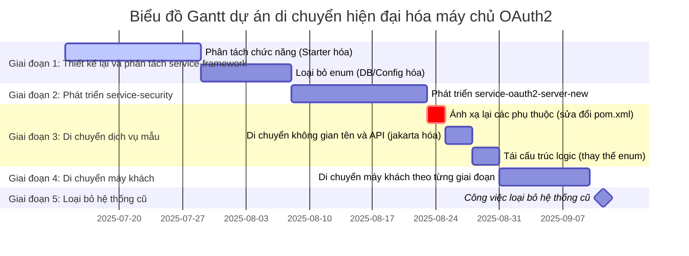

### Tóm tắt lịch trình

*   **Ngày bắt đầu dự án:** 14 tháng 7 năm 2025 (Thứ Hai)
*   **Ngày dự kiến hoàn thành Giai đoạn 1:** 15 tháng 8 năm 2025 (Thứ Sáu)
*   **Ngày dự kiến hoàn thành Giai đoạn 2:** 5 tháng 9 năm 2025 (Thứ Sáu)
*   **Ngày dự kiến hoàn thành Giai đoạn 3:** 17 tháng 9 năm 2025 (Thứ Tư)
*   **Ngày dự kiến hoàn thành Giai đoạn 4:** 1 tháng 10 năm 2025 (Thứ Tư)
*   **Ngày dự kiến hoàn thành dự án:** 6 tháng 10 năm 2025 (Thứ Hai)

**Lưu ý:** Biểu đồ Gantt này giả định rằng mỗi giai đoạn sẽ tiến hành tuần tự. Trong thực tế, các tác vụ như kiểm thử và tạo tài liệu sẽ được thực hiện song song trong mỗi giai đoạn.
